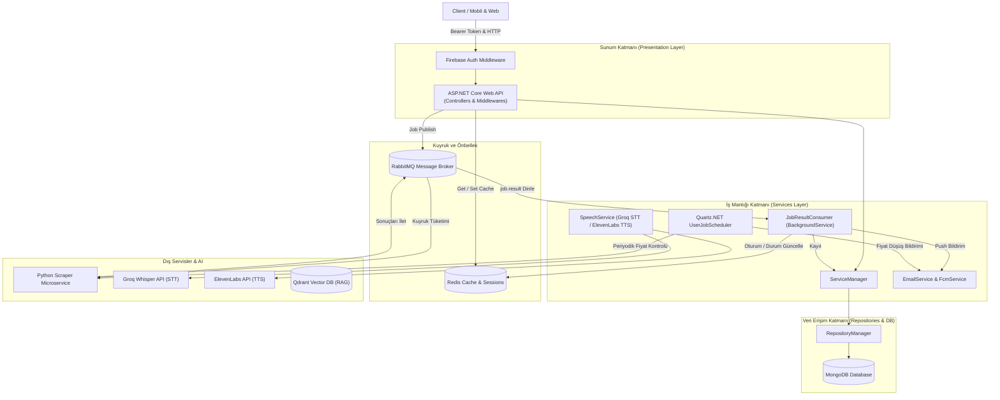

# 🛍️ Product Analysis & AI Price Tracking System (Graduation Project)

[](https://dotnet.microsoft.com/)
[](https://www.mongodb.com/)
[](https://redis.io/)
[](https://www.rabbitmq.com/)
[](https://qdrant.tech/)
[](https://firebase.google.com/)
[](https://github.com/aleynayilm/GraduationProjectV2)

Farklı e-ticaret platformlarından (Trendyol, Amazon, N11 vb.) ürün verilerini toplayan (**web scraping**), fiyat geçmişini ve düşüşlerini takip eden, kullanıcıları anlık olarak bilgilendiren (**E-Posta & FCM Push Notification**), yapay zeka destekli (**RAG**, **Local/Cloud LLM**) ürün karşılaştırması ve **Sesli Asistan** (STT & TTS) yetenekleri sunan kurumsal seviyede çok katmanlı bir backend sistemidir.

---

## 📌 İçindekiler
- [Mimari ve Tasarım](#-mimari-ve-tasarım)
- [Öne Çıkan Özellikler](#-öne-çıkan-özellikler)
- [Teknoloji Yığını](#-teknoloji-yığını)
- [Proje Katman Yapısı](#-proje-katman-yapısı)
- [Asenkron İş Akışı ve Mesajlaşma Mimarisi](#-asenkron-iş-akışı-ve-mesajlaşma-mimarisi)
- [Kurulum ve Başlangıç](#-kurulum-ve-başlangıç)
- [Yapılandırma (Configuration)](#-yapılandırma-configuration)
- [API Uç Noktaları (Endpoints)](#-api-uç-noktaları-endpoints)
- [Testler ve Kalite Güvencesi](#-testler-ve-kalite-güvencesi)
- [Katkıda Bulunma ve Lisans](#-katkıda-bulunma-ve-lisans)

---

## 🏛 Mimari ve Tasarım

Proje, **SoC (Separation of Concerns)** ve **Clean/N-Tier Architecture** prensiplerine uygun olarak tasarlanmıştır.



---

## 🚀 Öne Çıkan Özellikler

1. **Çoklu Platform Ürün Kazıma (Web Scraping):**
   - Trendyol, Amazon, N11 gibi platformlardan anlık ürün fiyatı, adı, görseli ve açıklamalarının asenkron çekilmesi.
2. **Akıllı Fiyat Takip & Bildirim Motoru (Quartz.NET):**
   - Kullanıcı tanımlı periyotlarla (örn. saatlik, günlük) arka planda otomatik fiyat kontrolü.
   - Fiyat düştüğünde **MailKit (SMTP)** ile dinamik şablonlu e-posta ve **Firebase Cloud Messaging (FCM)** ile anlık push bildirim gönderimi.
3. **Yapay Zeka Destekli Ürün Karşılaştırması:**
   - **Local LLM (Mistral / Yerel Model)** ve **Cloud LLM (Gemini)** entegrasyonu ile ürün özelliklerini ve fiyat/performans dengesini karşılaştırma.
   - Kullanıcıların karşılaştırma sonuçları üzerinde sohbete devam edebilmesi (**Redis tabanlı Chat Session Memory**).
4. **Tavily Arama & RAG (Retrieval-Augmented Generation):**
   - Tavily arama motoru ile gerçek zamanlı web verisi tarama, Qdrant vektör veritabanı desteği ile akıllı içerik analizi.
5. **Sesli Asistan & Çok Dilli Konuşma (STT & TTS):**
   - **Speech-to-Text (STT):** Groq Whisper (`whisper-large-v3`) ile yüksek hızlı ve yüksek doğruluklu ses deşifresi.
   - **Text-to-Speech (TTS):** ElevenLabs (`eleven_multilingual_v2`) ile doğal ses sentezleme (Base64 MP3 çıktı).
6. **Yapay Zeka ile Favori Kategorilendirme:**
   - Kullanıcının favorilerine eklediği ürünlerin LLM tarafından otomatik gruplanması ve etiketlenmesi.
7. **Firebase Kimlik Doğrulama:**
   - Özel `FirebaseAuthMiddleware` ve `FirebaseAuthHandler` ile JWT/Bearer token doğrulama.

---

## 💻 Teknoloji Yığını

| Alan | Teknoloji / Kütüphane | Açıklama |
|---|---|---|
| **Platform** | `.NET 8.0` / `.NET 9.0 (Test)` | Modern, yüksek performanslı web framework |
| **Veritabanı** | `MongoDB` (BSON & Driver) | NoSQL doküman tabanlı ana veritabanı |
| **Vektör Veritabanı** | `Qdrant` | RAG ve semantik arama için vektör depolama |
| **Mesaj Kuyruğu** | `RabbitMQ` (`RabbitMQ.Client 7.x`) | Asenkron iş dağıtımı ve olay tabanlı haberleşme |
| **Önbellek & Oturum** | `Redis` (`StackExchange.Redis`) | Job durumları ve sohbet geçmişi önbelleği |
| **Zamanlanmış Görevler** | `Quartz.NET` | Fiyat takip işlerinin yönetimi |
| **Kimlik & Bildirim** | `Firebase Admin SDK` | Kimlik doğrulama & FCM Push bildirimleri |
| **E-Posta** | `MailKit` & `MimeKit` | SMTP tabanlı HTML e-posta gönderimi |
| **Ses & AI** | `Groq API` (Whisper), `ElevenLabs API` | Ses tanıma ve seslendirme servisleri |
| **Harici Servis** | Python Scraper Microservice | Web kazıma ve RAG/LLM işçi servisi |
| **Eşleme (Mapping)** | `AutoMapper` | Entity - DTO dönüşümleri |
| **Dokümantasyon** | `Swagger / OpenAPI` (`Swashbuckle`) | Etkileşimli API test arayüzü |
| **Test** | `xUnit`, `Moq`, `FluentAssertions` | 600'den fazla kapsamlı birim testi |

---

## 📂 Proje Katman Yapısı

```text
GraduationProject2/
│
├── ProductAnalysisAppWithMongoDb/        # API Host & Başlangıç Projesi
│   ├── Program.cs                         # Servis kayıtları, pipeline ve konfigürasyon
│   ├── appsettings.json                   # Uygulama ayarları (DB, API Keys, SMTP)
│   ├── docker-compose.yml                 # RabbitMQ, Redis, Qdrant servisleri
│   ├── Middleware/                        # FirebaseAuthMiddleware & FirebaseAuthHandler
│   ├── Infrastructure/                    # FirebaseInitializer
│   └── Utilities/AutoMapper/              # AutoMapper MappingProfile
│
├── ProductAnalysisApp.Presentation/       # API Denetleyicileri (Controllers)
│   ├── Controllers/
│   │   ├── ProductScrapingController.cs   # Kazıma, arama ve geçmiş yönetimi
│   │   ├── ProductCompareController.cs    # LLM karşılaştırma ve chat uç noktaları
│   │   ├── VoiceChatController.cs         # Ses kaydı (STT), sohbet ve seslendirme (TTS)
│   │   ├── FavoriteController.cs          # Favori işlemleri ve AI kategorilendirme
│   │   ├── UserController.cs              # Kullanıcı profili, push token ve fiyat alarm ayarları
│   │   ├── ProductController.cs           # Ürün CRUD işlemleri
│   │   └── SearchHistoryController.cs     # Arama geçmişi yönetimi
│   └── Extensions/                        # ClaimsPrincipal genişletmeleri
│
├── ProductAnalysisApp.Services/           # İş Mantığı Servisleri
│   ├── Contracts/                         # Servis arayüzleri (Interfaces)
│   ├── Messaging/
│   │   ├── RabbitMqPublisher.cs           # RabbitMQ kuyruklarına mesaj yayınlayıcı
│   │   └── JobResultConsumer.cs           # Arka plan kuyruk tüketicisi (HostedService)
│   ├── PythonScraperService.cs            # Python mikroservisi ile HTTP haberleşmesi
│   ├── SpeechService.cs                   # Groq & ElevenLabs ses entegrasyonu
│   ├── PriceCheckJob.cs                   # Quartz fiyat kontrol işi
│   ├── UserJobScheduler.cs                # Dinamik Quartz iş zamanlayıcısı
│   ├── FcmService.cs                      # Firebase push bildirim servisi
│   ├── EmailService.cs                    # E-Posta bildirim servisi
│   ├── RedisService.cs                    # Redis job ve chat oturum servisi
│   └── ... (ProductManager, UserManager, FavoriteManager vb.)
│
├── ProductAnalysisApp.Repositories/       # Veri Erişim Katmanı (Repository Pattern)
│   ├── Contracts/                         # Repository arayüzleri
│   └── EFCore/                            # MongoDB context ve repository implementasyonları
│
├── ProductAnalysisApp.Entities/           # Domain Modelleri ve DTO'lar
│   ├── Models/                            # Product, User, Favorite, Platform, Category...
│   └── DataTransferObjects/               # İstek / Yanıt DTO nesneleri
│
└── ProductAnalysisApp.Tests/              # Birim ve Entegrasyon Testleri (600+ Test)
    ├── ControllersUnitTests/              # Controller testleri
    ├── ServicesUnitTests/                 # Servis testleri
    ├── RepositoriesUnitTests/             # Repository testleri
    └── InfrastructureTests/               # Altyapı ve Middleware testleri
```

---

## 🔄 Asenkron İş Akışı ve Mesajlaşma Mimarisi

Uzun süren web kazıma, LLM ile analiz ve RAG sorguları kullanıcıyı bloklamamak adına kuyruk üzerinden asenkron yönetilir:

1. Kullanıcı bir istek gönderdiğinde (`POST /api/ProductScraping/scrape` vb.):
   - Sistem benzersiz bir `jobId` üretir.
   - Redis içerisine iş durumu `pending` olarak kaydedilir.
   - İş verisi ilgili RabbitMQ kuyruğuna iletilir ve kullanıcıya anında `202 Accepted` ile `jobId` döndürülür.
2. İşçi servis (Python Worker / LLM Engine) mesajı işler.
3. Sonuç, `job.result` kuyruğuna basılır.
4. .NET tarafındaki `JobResultConsumer` (`BackgroundService`):
   - Redis'teki iş durumunu `completed` veya `failed` olarak günceller.
   - Eğer sonuç ürün kazıma ise verileri **MongoDB**'ye yazar.
   - Eğer kullanıcı push bildirimlerini açmışsa **Firebase Cloud Messaging** ile mobil/web istemcisine bildirim yollar.
5. İstemci, `jobId` üzerinden sonucu sorgulayabilir veya bildirimi bekleyebilir.

### RabbitMQ Kuyrukları:
- `job.scrape`: Tekil ürün kazıma işleri
- `job.compare`: Çoklu ürün/platform kazıma ve karşılaştırma işleri
- `job.localllmcompare`: Yerel LLM karşılaştırma işleri
- `job.cloudllmcompare`: Bulut LLM karşılaştırma işleri
- `job.chat_local`: Yerel LLM sohbet devamı
- `job.chat_cloud`: Bulut LLM sohbet devamı
- `job.local_search`: Tavily + RAG + Mistral yerel arama
- `job.cloud_search`: Tavily + RAG + Gemini bulut arama
- `job.result`: Tamamlanan tüm iş sonuçlarının toplandığı kuyruk

---

## 🛠 Kurulum ve Başlangıç

### Gereksinimler
- [.NET 8.0 SDK](https://dotnet.microsoft.com/download/dotnet/8.0) (Testler için .NET 9.0 SDK yüklü olabilir)
- [Docker & Docker Desktop](https://www.docker.com/)
- [MongoDB](https://www.mongodb.com/) (Yerel veya MongoDB Atlas)
- Firebase Projesi (`serviceAccount.json`)

### 1. Depoyu Klonlayın
```bash
git clone https://github.com/aleynayilm/GraduationProjectV2.git
cd GraduationProject2
```

### 2. Destekleyici Servisleri Başlatın (Docker)
RabbitMQ, Redis ve Qdrant servislerini Docker Compose ile tek komutla başlatın:
```bash
cd ProductAnalysisAppWithMongoDb
docker compose up -d
```
> - **RabbitMQ Yönetim Paneli:** http://localhost:15672 (Kullanıcı: `guest` / Şifre: `guest`)
> - **Redis:** localhost:6379
> - **Qdrant:** http://localhost:6333

### 3. Firebase Servis Hesabı Dosyası
Firebase Console üzerinden indirdiğiniz `serviceAccount.json` dosyasını `ProductAnalysisAppWithMongoDb/` dizini altına kopyalayın.

### 4. Bağımlılıkları Yükleyin ve Derleyin
```bash
dotnet restore ProductAnalysisAppWithMongoDb/ProductAnalysisAppWithMongoDb.sln
dotnet build ProductAnalysisAppWithMongoDb/ProductAnalysisAppWithMongoDb.sln
```

### 5. Uygulamayı Çalıştırın
```bash
dotnet run --project ProductAnalysisAppWithMongoDb/ProductAnalysisAppWithMongoDb.csproj
```
Uygulama ayağa kalktığında Swagger UI arayüzüne tarayıcınızdan erişebilirsiniz:
👉 **https://localhost:7109/swagger**

---

## ⚙️ Yapılandırma (Configuration)

`ProductAnalysisAppWithMongoDb/appsettings.json` dosyası üzerinden servis ayarlarını yapılandırabilirsiniz:

```json
{
  "ConnectionStrings": {
    "MongoConnection": "mongodb://localhost:27017",
    "MongoDatabase": "ProductAnalysisDb"
  },
  "Redis": {
    "ConnectionString": "localhost:6379"
  },
  "RabbitMQ": {
    "Host": "localhost"
  },
  "Firebase": {
    "CredentialPath": "serviceAccount.json"
  },
  "Smtp": {
    "Host": "smtp.gmail.com",
    "Port": 587,
    "Username": "your-email@gmail.com",
    "Password": "your-app-password",
    "FromName": "Fiyat Takip Sistemi"
  },
  "Groq": {
    "ApiKey": "YOUR_GROQ_API_KEY"
  },
  "ElevenLabs": {
    "ApiKey": "YOUR_ELEVENLABS_API_KEY",
    "VoiceId": "XrExE9yKIg1WjnnlVkGX"
  },
  "PythonScraperService": {
    "BaseUrl": "http://localhost:8000"
  }
}
```

---

## 📡 API Uç Noktaları (Endpoints)

Tüm korumalı uç noktalar HTTP Header'da `Authorization: Bearer <Firebase_ID_Token>` bekler.

### 🔍 Ürün Kazıma ve Arama (`/api/ProductScraping`)
| Metot | Uç Nokta | Açıklama |
|---|---|---|
| `POST` | `/api/ProductScraping/scrape` | Ürün URL kazıma & karşılaştırma işi başlatır (Kuyruk). |
| `GET` | `/api/ProductScraping/scrape/{jobId}` | Kazıma işinin durumunu ve verilerini döner. |
| `GET` | `/api/ProductScraping/jobs` | Kullanıcının son işlerini listeler. |
| `GET` | `/api/ProductScraping/search-history` | Kullanıcının arama geçmişini getirir. |
| `POST` | `/api/ProductScraping/local-search` | Tavily + RAG + Mistral yerel arama işi başlatır. |
| `GET` | `/api/ProductScraping/local-search/{jobId}` | Yerel arama sonucunu döner. |
| `POST` | `/api/ProductScraping/cloud-search` | Tavily + RAG + Gemini bulut arama işi başlatır. |
| `GET` | `/api/ProductScraping/cloud-search/{jobId}` | Bulut arama sonucunu döner. |

### 🤖 LLM Karşılaştırma & Chat (`/api/ProductCompare`)
| Metot | Uç Nokta | Açıklama |
|---|---|---|
| `POST` | `/api/ProductCompare/cloudllmcompare` | Bulut LLM (Gemini) ile ürünleri karşılaştırır. |
| `GET` | `/api/ProductCompare/cloudllmcompare/{jobId}` | Bulut karşılaştırma sonucunu sorgular. |
| `POST` | `/api/ProductCompare/localllmcompare` | Yerel LLM ile ürünleri karşılaştırır. |
| `GET` | `/api/ProductCompare/localllmcompare/{jobId}` | Yerel karşılaştırma sonucunu sorgular. |
| `POST` | `/api/ProductCompare/chat-local` | Karşılaştırma oturumunda yerel LLM ile sohbete devam eder. |
| `POST` | `/api/ProductCompare/chat-cloud` | Karşılaştırma oturumunda bulut LLM ile sohbete devam eder. |
| `GET` | `/api/ProductCompare/result/{jobId}` | Genel job durumunu döner. |

### 🎙️ Sesli Sohbet, STT ve TTS (`/api/VoiceChat`)
| Metot | Uç Nokta | Açıklama |
|---|---|---|
| `POST` | `/api/VoiceChat/transcribe` | Ses dosyasını (m4a, mp3, wav) Groq Whisper ile metne çevirir. |
| `POST` | `/api/VoiceChat/chat` | Sesli sohbet metnini iş kuyruğuna iletir (Local/Cloud). |
| `GET` | `/api/VoiceChat/chat/{jobId}` | Sohbet cevabını döner ve oturuma ekler. |
| `POST` | `/api/VoiceChat/synthesize` | Metni ElevenLabs ile konuşma sesine (Base64 MP3) dönüştürür. |

### ⭐ Favoriler (`/api/Favorite`)
| Metot | Uç Nokta | Açıklama |
|---|---|---|
| `GET` | `/api/Favorite` | Kullanıcının tüm favori ürünlerini detaylarıyla listeler. |
| `GET` | `/api/Favorite/{id}` | Belirli bir favori kaydını getirir. |
| `POST` | `/api/Favorite` | Ürünü favorilere ekler. |
| `DELETE` | `/api/Favorite/{favoriteId}` | Favorilerden çıkarır. |
| `POST` | `/api/Favorite/toggle` | Ürünü favoriye ekler/çıkarır (Toggle). |
| `POST` | `/api/Favorite/categorize` | Kullanıcının favorilerini yapay zeka ile otomatik etiketler. |

### 👤 Kullanıcı & Fiyat Alarm Yönetimi (`/api/Users`)
| Metot | Uç Nokta | Açıklama |
|---|---|---|
| `POST` | `/api/Users/register` | Firebase kullanıcısını veritabanına kaydeder. |
| `GET` | `/api/Users/{firebaseUid}` | Kullanıcı profil bilgilerini döner. |
| `PUT` | `/api/Users/push-token` | FCM Push Token bilgisini kaydeder/günceller. |
| `PUT` | `/api/Users/price-alert` | Fiyat alarmını açar/kapatır ve kontrol aralığını (saat) ayarlar. |
| `POST` | `/api/Users/test-price-check` | Kullanıcı için fiyat kontrol Quartz job'ını anlık tetikler. |

---

## 🧪 Testler ve Kalite Güvencesi

Projede Controller, Service, Repository, Middleware ve Altyapı katmanlarını kapsayan **600'den fazla** kapsamlı birim (unit) testi bulunmaktadır:

```bash
dotnet test ProductAnalysisAppWithMongoDb/ProductAnalysisAppWithMongoDb.sln
```

### Test Özeti:
```text
Toplam Test Dosyası : 1 (ProductAnalysisApp.Tests.dll)
Başarılı            : 603
Başarısız           : 0
Atlanan             : 0
Sonuç               : %100 Başarı Oranı
```

Kullanılan test teknolojileri:
- **xUnit**: Test koşturucu ve çerçeve
- **Moq**: Bağımlılıkların (DB, RabbitMQ, Redis, HTTP istemcileri) simülasyonu
- **FluentAssertions**: Doğal ve okunaklı test assertion yapıları
- **Coverlet**: Kod kapsama analizi

---

## 📄 Lisans ve Katkıda Bulunma

Bu proje mezuniyet projesi kapsamında geliştirilmiştir. Her türlü öneri, hata bildirimi ve katkı için PR açabilir veya iletişime geçebilirsiniz.

✨ **Geliştirici:** [Aleyna Yılmaz](https://github.com/aleynayilm)
